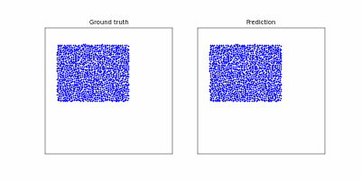

## Learning to Simulate Complex Physics with Graph Networks in pytorch geometric
Minimal pytorch+pytorch geometric version of https://arxiv.org/abs/2002.09405 and https://github.com/deepmind/deepmind-research/tree/master/learning_to_simulate

Result of 425k steps of training:

